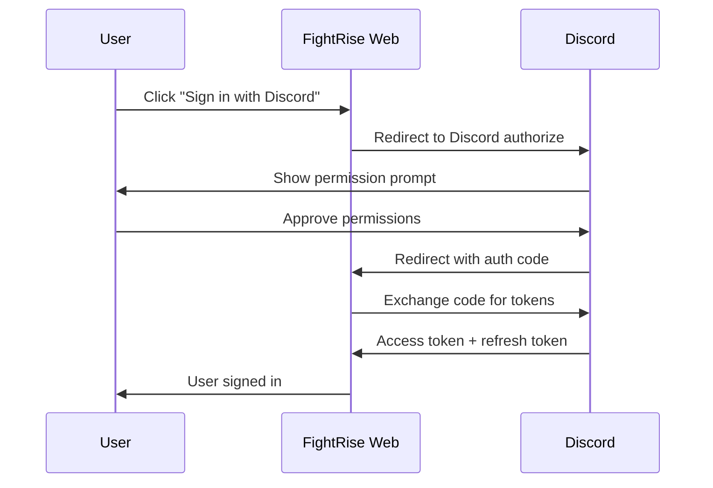

# Discord Bot Setup Guide

This guide walks you through setting up a Discord application and bot for FightRise.

## Prerequisites

Before you begin, make sure you have:

- **Discord account** with verified email address
- **Administrator access** to a Discord server (for testing the bot)
- **Text editor** for managing `.env` files
- **Node.js 18+** installed (for running the bot locally)

**Estimated time:** 15-20 minutes

## Related Documentation

| Document | Description |
|----------|-------------|
| [README.md](../README.md) | Quick start guide |
| **Discord Setup** (this doc) | Discord bot configuration |
| [Start.gg Setup](./STARTGG_SETUP.md) | Start.gg API setup |
| [Tunnel Setup](./TUNNEL_SETUP.md) | Cloudflare Tunnel for OAuth |
| [Implementation Status](./IMPLEMENTATION_STATUS.md) | Current progress |
| [Architecture Plan](../ARCHITECTURE_PLAN.md) | Full system design |

---

## Table of Contents
1. [Creating a Discord Application](#creating-a-discord-application)
2. [Configuring the Bot](#configuring-the-bot)
3. [Gateway Intents](#gateway-intents)
4. [OAuth2 Configuration](#oauth2-configuration)
5. [Generating the Bot Invite URL](#generating-the-bot-invite-url)
6. [Environment Variables](#environment-variables)
7. [Security Best Practices](#security-best-practices)

---

## Creating a Discord Application

### Step 1: Access the Developer Portal

1. Go to the [Discord Developer Portal](https://discord.com/developers/applications)
2. Sign in with your Discord account
3. Click the **"New Application"** button in the top right

### Step 2: Create the Application

1. Enter a name for your application (e.g., "FightRise Bot" or "FightRise Tournament")
2. Agree to the Discord Developer Terms of Service
3. Click **"Create"**

### Step 3: Note Your Application Credentials

On the **General Information** tab, you'll find:
- **Application ID** - This is your `DISCORD_CLIENT_ID`
- **Public Key** - Used for interaction verification (not needed for this bot)

---

## Configuring the Bot

### Step 1: Create the Bot User

1. Navigate to the **"Bot"** tab in the left sidebar
2. A bot user is created automatically with your application
3. You can customize the bot's username and avatar here

### Step 2: Get the Bot Token

1. Under the **"Token"** section, click **"Reset Token"**
2. Confirm the action (this will invalidate any previous token)
3. **Copy the token immediately** - you cannot view it again
4. This is your `DISCORD_TOKEN` environment variable

> **WARNING**: Never share your bot token. Anyone with this token can control your bot. If your token is compromised, regenerate it immediately.

### Step 3: Configure Bot Settings

Under the **"Bot"** section, configure these settings:

| Setting | Recommended | Description |
|---------|-------------|-------------|
| **Public Bot** | ✅ Enabled | Allows others to invite your bot |
| **Requires OAuth2 Code Grant** | ❌ Disabled | Not needed for FightRise |
| **Presence Intent** | ❌ Disabled | Not needed |
| **Server Members Intent** | ❌ Disabled | Not needed currently |
| **Message Content Intent** | ✅ Enabled | Required for reading messages in threads |

---

## Gateway Intents

Gateway Intents control what events your bot receives from Discord. FightRise uses these intents:

### Required Intents

| Intent | Privileged | Why It's Needed |
|--------|------------|-----------------|
| `Guilds` | No | Access to guild/server information |
| `GuildMessages` | No | Receive message events in guild channels |
| `MessageContent` | **Yes** | Read message content in match threads |

### Enabling Privileged Intents

The **Message Content Intent** is privileged and must be explicitly enabled:

1. Go to **Bot** tab in Developer Portal
2. Scroll to **"Privileged Gateway Intents"**
3. Enable **"Message Content Intent"**
4. Save changes

> **Note**: If your bot is in 100+ servers, Discord may require verification to use privileged intents.

### Intent Configuration in Code

The bot is configured with these intents in `apps/bot/src/index.ts`:

```typescript
import { Client, GatewayIntentBits } from 'discord.js';

const client = new Client({
  intents: [
    GatewayIntentBits.Guilds,
    GatewayIntentBits.GuildMessages,
    GatewayIntentBits.MessageContent,
  ],
});
```

---

## OAuth2 Configuration

OAuth2 is used for two purposes:
1. **Bot invites** - Adding the bot to servers
2. **User authentication** - Web portal sign-in via Discord

### OAuth2 Flow Diagram



### Required OAuth2 Scopes

| Scope | Purpose |
|-------|---------|
| `bot` | Adds the bot user to a guild with permissions |
| `applications.commands` | Enables slash commands |
| `identify` | Web portal: Access user's Discord ID and username |
| `guilds` | Web portal: Access user's guild list |

### Configuring OAuth2 for Web Portal

1. Go to **OAuth2** → **General** in Developer Portal
2. Add your redirect URIs:
   - User authentication (web portal):
     - Development (local only): `http://localhost:3000/api/auth/callback/discord`
     - Development (with tunnel): `https://fightrise-dev.yourdomain.com/api/auth/callback/discord`
     - Production: `https://your-domain.com/api/auth/callback/discord`
   - Bot installation callback:
     - Development (local only): `http://localhost:3000/api/auth/callback/bot`
     - Development (with tunnel): `https://fightrise-dev.yourdomain.com/api/auth/callback/bot`
     - Production: `https://your-domain.com/api/auth/callback/bot`
3. Note your **Client Secret** (click "Reset Secret" if needed)
   - This is your `DISCORD_CLIENT_SECRET`

> **Note:** OAuth callbacks require publicly accessible URLs. For local development with OAuth, use [Cloudflare Tunnel](../README.md#cloudflare-tunnel-for-oauth) to expose your local server.

---

## Generating the Bot Invite URL

### Using Discord's URL Generator

1. Go to **OAuth2** → **URL Generator**
2. Select these **Scopes**:
   - ✅ `bot`
   - ✅ `applications.commands`

3. Select these **Bot Permissions**:

#### Required Permissions

| Permission | Bit | Why It's Needed |
|------------|-----|-----------------|
| Send Messages | `2048` | Post in channels |
| Send Messages in Threads | `274877906944` | Post in match threads |
| Create Public Threads | `34359738368` | Create match threads |
| Create Private Threads | `68719476736` | Optional: private match threads |
| Manage Threads | `17179869184` | Archive threads after matches |
| Embed Links | `16384` | Rich embeds for match info |
| Read Message History | `65536` | Access thread history |
| Mention Everyone | `131072` | Ping players for matches |
| Use Application Commands | `2147483648` | Slash commands |
| View Channels | `1024` | Access channel list |

### Recommended Permission Integer

For FightRise, use this permissions integer: `397284690944`

This includes all required permissions listed above.

### Generated Invite URL Format

```
https://discord.com/api/oauth2/authorize?client_id=YOUR_CLIENT_ID&permissions=397284690944&scope=bot%20applications.commands
```

Replace `YOUR_CLIENT_ID` with your actual Application ID.

### Alternative: Minimal Permissions

If you want to start with minimal permissions and add more later:

```
Minimal permissions integer: 277025508352
```

This covers basic messaging and thread creation.

---

## Environment Variables

Add these to your `.env` file:

```bash
# Discord Bot Configuration
DISCORD_TOKEN="your-bot-token-from-bot-tab"
DISCORD_CLIENT_ID="your-application-id-from-general-info"
DISCORD_CLIENT_SECRET="your-client-secret-from-oauth2"

# OAuth Redirect URIs
DISCORD_REDIRECT_URI="http://localhost:3000/api/auth/callback/discord"
DISCORD_BOT_REDIRECT_URI="http://localhost:3000/api/auth/callback/bot"
```

### Where to Find Each Value

| Variable | Location in Developer Portal |
|----------|------------------------------|
| `DISCORD_TOKEN` | Bot → Token → Reset Token |
| `DISCORD_CLIENT_ID` | General Information → Application ID |
| `DISCORD_CLIENT_SECRET` | OAuth2 → General → Client Secret |
| `DISCORD_BOT_REDIRECT_URI` | OAuth2 → General → Redirect URIs (add new) |

---

## Security Best Practices

### Token Security

1. **Never commit tokens to version control**
   - Use `.env` files and ensure `.env` is in `.gitignore`

2. **Use environment variables**
   - Never hardcode tokens in source code

3. **Limit token access**
   - Only share tokens with trusted team members through secure channels

### Token Rotation

Regular token rotation reduces the risk of compromised credentials.

**Rotation Schedule:**
| Token Type | Recommended Interval |
|------------|---------------------|
| Bot Token | Every 90 days |
| Client Secret | Every 90 days |

**When to Rotate Immediately:**
- A team member with token access leaves the project
- You suspect the token may have been exposed
- After a security incident
- Token appears in logs, error messages, or version control

**How to Rotate:**
1. **Bot Token**: Go to Bot tab → Click "Reset Token" → Update `.env` → Restart bot
2. **Client Secret**: Go to OAuth2 → Click "Reset Secret" → Update `.env` → Restart web app

**Best Practice:** Create the new token and verify it works before revoking the old one (where possible).

### Permission Principles

1. **Request minimum permissions**
   - Only enable permissions your bot actually uses

2. **Disable unused intents**
   - Reduces data your bot receives and improves privacy

3. **Audit permissions regularly**
   - Review and remove permissions no longer needed

### OAuth2 Security

1. **Validate redirect URIs**
   - Only add URIs you control to the OAuth2 settings

2. **Use HTTPS in production** (mandatory)
   - Never use HTTP redirect URIs in production
   - Exception: `http://localhost` is allowed for local development only

3. **Validate state parameter**
   - Implement CSRF protection in OAuth flows
   - NextAuth.js handles this automatically

### Production Secrets Management

For production deployments, use a dedicated secrets manager instead of `.env` files:

| Service | Best For | Key Features |
|---------|----------|--------------|
| **AWS Secrets Manager** | AWS-hosted apps | Automatic rotation, IAM integration |
| **HashiCorp Vault** | Multi-cloud, K8s | Open-source, highly configurable |
| **Azure Key Vault** | Azure-hosted apps | Azure AD integration |
| **Google Secret Manager** | GCP-hosted apps | IAM integration, versioning |
| **Railway/Render Secrets** | Smaller deployments | Built-in, easy setup |

**Benefits over `.env` files:**
- Automatic token rotation
- Audit logging (who accessed what, when)
- Encryption at rest
- Fine-grained access control
- Version history and rollback

---

## Troubleshooting

### Bot Not Responding to Commands

1. **Check the bot is online** - Look for green status indicator
2. **Verify commands are deployed** - Run `npm run deploy -- --filter=@fightrise/bot`
3. **Check bot has permissions** - Ensure bot role has required permissions in the channel
4. **Check intents are enabled** - Verify privileged intents in Developer Portal

### "Missing Access" or Permission Errors

1. **Re-invite the bot** with updated permissions
2. **Check role hierarchy** - Bot's role must be above roles it manages
3. **Check channel permissions** - Channel-specific overrides may block the bot

### OAuth Login Fails

1. **Verify redirect URI matches exactly** - Including trailing slashes
2. **Check client secret** - Ensure it hasn't been rotated
3. **Check scopes** - Ensure `identify` scope is included

---

## Additional Resources

- [Discord Developer Portal](https://discord.com/developers/applications)
- [Discord.js Guide](https://discordjs.guide/)
- [Discord API Documentation](https://discord.com/developers/docs)
- [Discord Permissions Calculator](https://discordapi.com/permissions.html)

---

## Next Steps

Now that Discord is configured:

- [ ] Complete [Start.gg Setup](./STARTGG_SETUP.md) if you haven't already
- [ ] Run `npm install` at the repository root
- [ ] Copy `.env.example` to `.env` and add your credentials
- [ ] Run `npm run dev -- --filter=@fightrise/bot` to start the bot
- [ ] Invite the bot to your test server using the generated URL
- [ ] Test with `/tournament setup` command

See [Implementation Status](./IMPLEMENTATION_STATUS.md) to track progress or find ways to contribute.
