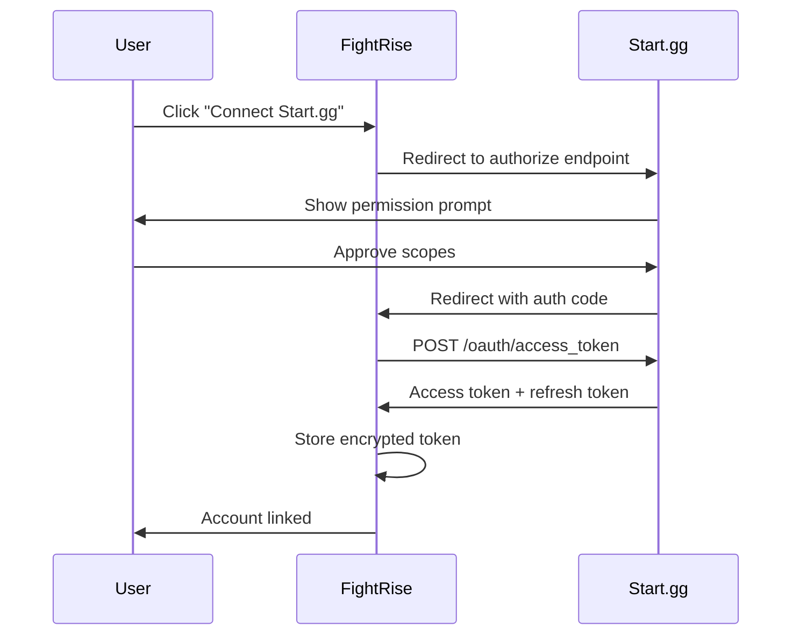

# Start.gg API Setup Guide

This guide walks you through setting up Start.gg API access for FightRise.

## Prerequisites

Before you begin, make sure you have:

- **Start.gg account** at [start.gg](https://start.gg)
- **Text editor** for managing `.env` files
- **curl or API client** (optional, for testing)

**Estimated time:** 10-15 minutes

## Related Documentation

| Document | Description |
|----------|-------------|
| [Discord Setup](./Discord-Setup) | Discord bot configuration |
| **Start.gg Setup** (this doc) | Start.gg API setup |
| [Tunnel Setup](./Tunnel-Setup) | Cloudflare Tunnel for OAuth |
| [Implementation Status](./Implementation-Status) | Current progress |
| [Architecture](./Architecture) | System architecture overview |

---

## Table of Contents
1. [Overview](#overview)
2. [Getting an API Token](#getting-an-api-token)
3. [API Basics](#api-basics)
4. [Rate Limits](#rate-limits)
5. [OAuth2 Setup (Advanced)](#oauth2-setup-advanced)
6. [Environment Variables](#environment-variables)
7. [Testing Your Setup](#testing-your-setup)

---

## Overview

Start.gg (formerly Smash.gg) provides a GraphQL API for accessing tournament data. FightRise uses this API to:

- Fetch tournament information and brackets
- Retrieve match/set data and player standings
- Report match results
- Sync registrations

### API Type

- **Protocol**: GraphQL
- **Endpoint**: `https://api.start.gg/gql/alpha`
- **Authentication**: Bearer token

---

## Getting an API Token

### Step 1: Access Developer Settings

1. Log in to [Start.gg](https://start.gg)
2. Click your profile icon in the top right
3. Select **"Developer Settings"** or go directly to:
   `https://start.gg/admin/profile/developer`

### Step 2: Create a New Token

1. Click **"Create new token"**
2. Enter a descriptive name (e.g., "FightRise Bot - Production")
3. Click **"Save"**

### Step 3: Copy Your Token

> **CRITICAL**: Copy your token immediately after creation. You **cannot view it again** once you leave the page.

The token will look something like:
```
d4f7a8b3c2e1f0...
```

This is your `STARTGG_API_KEY` environment variable.

---

## API Basics

### Making Requests

All API requests must include the `Authorization` header:

```
Authorization: Bearer YOUR_TOKEN_HERE
```

### GraphQL Endpoint

Send all queries and mutations to:
```
POST https://api.start.gg/gql/alpha
```

### Example Query

```graphql
query GetTournament($slug: String!) {
  tournament(slug: $slug) {
    id
    name
    startAt
    endAt
    events {
      id
      name
      numEntrants
    }
  }
}
```

### Example Request (curl)

```bash
curl -X POST https://api.start.gg/gql/alpha \
  -H "Authorization: Bearer YOUR_TOKEN" \
  -H "Content-Type: application/json" \
  -d '{
    "query": "query { currentUser { id } }"
  }'
```

---

## Rate Limits

Start.gg enforces strict rate limits to prevent abuse:

### Request Limits

| Limit Type | Threshold | Time Window |
|------------|-----------|-------------|
| Request frequency | 80 requests | 60 seconds |
| Objects per request | 1,000 objects | Per request |

### What Counts as an Object?

The 1,000 object limit includes all returned data, including nested objects. For example:
- A tournament with 50 events and 20 entrants each = 1,050 objects (exceeds limit)
- Use pagination to stay under limits

### Rate Limit Response

When you exceed limits, you'll receive:

```json
{
  "success": false,
  "message": "Rate limit exceeded - api-token"
}
```

### Best Practices

1. **Implement caching** - Don't fetch the same data repeatedly
2. **Use pagination** - Fetch large datasets in smaller chunks
3. **Add delays** - Space out requests during polling
4. **Implement exponential backoff** - Back off when rate limited

FightRise's `@fightrise/startgg-client` package handles these automatically with:
- Response caching with TTL
- Automatic retry with exponential backoff
- Request queuing

---

## OAuth2 Setup (Advanced)

OAuth2 allows users to authorize FightRise to access their personal Start.gg data and perform actions on their behalf. This is required for:

- Verifying tournament admin status
- Registering players on behalf of users
- Reporting scores as authenticated users

### Step 1: Create OAuth Application

1. Go to [Start.gg Developer Settings](https://start.gg/admin/profile/developer)
2. Navigate to **"OAuth Applications"**
3. Click **"Create Application"**
4. Fill in the required fields:
   - **Name**: FightRise
   - **Redirect URIs**: Your callback URLs

### Step 2: Configure Redirect URIs

Add these redirect URIs:

```
# Development (local only - won't work for OAuth testing)
http://localhost:3000/api/auth/callback/startgg

# Development (with Cloudflare Tunnel - recommended for OAuth)
https://fightrise-dev.yourdomain.com/api/auth/callback/startgg

# Production
https://your-domain.com/api/auth/callback/startgg
```

> **Note:** OAuth callbacks require publicly accessible URLs. For local development with OAuth, use [Cloudflare Tunnel](./Tunnel-Setup) to expose your local server.

### Step 3: Note OAuth Credentials

After creating the application, you'll receive:
- **Client ID** - Your OAuth application ID
- **Client Secret** - Keep this secure

### OAuth Scopes

| Scope | Description | When Needed |
|-------|-------------|-------------|
| `user.identity` | Access user's basic profile | Always |
| `user.email` | Access user's email | Optional |
| `tournament.manager` | Manage tournament seeding and brackets | Admin verification |
| `tournament.reporter` | Report match results | Score reporting |

### OAuth Flow



#### Step-by-Step

1. **Authorization URL**:
   ```
   https://start.gg/oauth/authorize?response_type=code&client_id=YOUR_CLIENT_ID&scope=user.identity&redirect_uri=YOUR_REDIRECT_URI&state=RANDOM_STATE
   ```

2. **Token Exchange**: POST to `https://api.start.gg/oauth/access_token`
   ```json
   {
     "grant_type": "authorization_code",
     "code": "AUTHORIZATION_CODE",
     "client_id": "YOUR_CLIENT_ID",
     "client_secret": "YOUR_CLIENT_SECRET",
     "redirect_uri": "YOUR_REDIRECT_URI"
   }
   ```

3. **Refresh Token**: POST to `https://api.start.gg/oauth/refresh`
   ```json
   {
     "grant_type": "refresh_token",
     "refresh_token": "YOUR_REFRESH_TOKEN",
     "client_id": "YOUR_CLIENT_ID",
     "client_secret": "YOUR_CLIENT_SECRET"
   }
   ```

---

## Environment Variables

Add these to your `.env` file:

```bash
# Start.gg API (Required)
STARTGG_API_KEY="your-api-token-from-developer-settings"

# Start.gg OAuth (Optional - for user authentication)
STARTGG_CLIENT_ID="your-oauth-client-id"
STARTGG_CLIENT_SECRET="your-oauth-client-secret"
STARTGG_REDIRECT_URI="http://localhost:3000/api/auth/callback/startgg"
```

### Where to Find Each Value

| Variable | Location |
|----------|----------|
| `STARTGG_API_KEY` | Developer Settings → Tokens → Create New Token |
| `STARTGG_CLIENT_ID` | Developer Settings → OAuth Applications → Your App |
| `STARTGG_CLIENT_SECRET` | Developer Settings → OAuth Applications → Your App |

---

## Testing Your Setup

### Quick Test with curl

```bash
# Test your API token
curl -X POST https://api.start.gg/gql/alpha \
  -H "Authorization: Bearer $STARTGG_API_KEY" \
  -H "Content-Type: application/json" \
  -d '{"query": "{ currentUser { id } }"}'
```

Expected response:
```json
{
  "data": {
    "currentUser": {
      "id": "12345"
    }
  }
}
```

### Test with FightRise Client

Run the smoke tests:

```bash
npm run test:smoke -- --filter=@fightrise/startgg-client
```

### API Explorer

Use Start.gg's interactive API Explorer to test queries:
- [Start.gg API Explorer](https://developer.start.gg/explorer)

You'll need to authenticate with your token in the explorer settings.

---

## Common Queries

### Get Tournament by Slug

```graphql
query GetTournament($slug: String!) {
  tournament(slug: $slug) {
    id
    name
    slug
    startAt
    endAt
    events {
      id
      name
      numEntrants
      state
    }
  }
}
```

Variables:
```json
{
  "slug": "tournament/my-tournament-2024"
}
```

### Get Event Sets (Matches)

```graphql
query GetEventSets($eventId: ID!, $page: Int!, $perPage: Int!) {
  event(id: $eventId) {
    sets(page: $page, perPage: $perPage, sortType: STANDARD) {
      pageInfo {
        total
        totalPages
      }
      nodes {
        id
        state
        fullRoundText
        identifier
        slots {
          entrant {
            id
            name
          }
        }
      }
    }
  }
}
```

### Report Match Result

```graphql
mutation ReportSet($setId: ID!, $winnerId: ID!) {
  reportBracketSet(setId: $setId, winnerId: $winnerId) {
    id
    state
  }
}
```

---

## Security Best Practices

### Token Security

1. **Never commit tokens to version control**
   - Use `.env` files and ensure `.env` is in `.gitignore`

2. **Use environment variables**
   - Never hardcode tokens in source code

3. **Limit token access**
   - Only share tokens with trusted team members through secure channels

### Token Rotation

Regular token rotation reduces the risk of compromised credentials.

**Rotation Schedule:**
| Token Type | Recommended Interval |
|------------|---------------------|
| API Token | Every 90 days |
| OAuth Client Secret | Every 90 days |

**When to Rotate Immediately:**
- A team member with token access leaves the project
- You suspect the token may have been exposed
- After a security incident
- Unusual API activity detected (check Developer Settings usage logs)

**How to Rotate:**
1. **API Token**: Developer Settings → Create new token → Update `.env` → Test → Delete old token
2. **OAuth Secret**: OAuth Applications → Your App → Regenerate secret → Update `.env`

**Best Practice:** Create the new token and verify it works before deleting the old one.

### OAuth Token Storage

User OAuth tokens (access and refresh tokens) should be:
- Encrypted at rest using AES-256 or equivalent
- Never logged or exposed in error messages
- Stored with minimal retention (refresh as needed)

### Production Secrets Management

For production deployments, use a dedicated secrets manager instead of `.env` files:

| Service | Best For | Key Features |
|---------|----------|--------------|
| **AWS Secrets Manager** | AWS-hosted apps | Automatic rotation, IAM integration |
| **HashiCorp Vault** | Multi-cloud, K8s | Open-source, highly configurable |
| **Azure Key Vault** | Azure-hosted apps | Azure AD integration |
| **Google Secret Manager** | GCP-hosted apps | IAM integration, versioning |
| **Railway/Render Secrets** | Smaller deployments | Built-in, easy setup |

**Benefits over `.env` files:**
- Automatic token rotation
- Audit logging (who accessed what, when)
- Encryption at rest
- Fine-grained access control
- Version history and rollback

---

## Troubleshooting

### "Authentication failed"

1. **Token expired or invalid** - Create a new token in Developer Settings
2. **Wrong header format** - Ensure it's `Authorization: Bearer TOKEN` (note the space)
3. **Token not copied correctly** - Tokens can be long; ensure you copied the full string

### "Rate limit exceeded"

1. **Too many requests** - Add delays between requests (wait at least 750ms)
2. **Request too large** - Reduce the number of objects requested via pagination
3. **Implement caching** - Cache responses to avoid duplicate requests

### "Object limit exceeded"

1. **Paginate your queries** - Use `page` and `perPage` parameters
2. **Reduce nested depth** - Only request fields you need
3. **Split into multiple queries** - Break up large requests

### Tournament Not Found

1. **Check the slug format** - Should be `tournament/slug-name` or just `slug-name`
2. **Tournament may be private** - Some tournaments require authentication
3. **Tournament may be deleted** - Verify it exists on start.gg

---

## Additional Resources

- [Start.gg Developer Portal](https://developer.start.gg/)
- [Start.gg API Introduction](https://developer.start.gg/docs/intro/)
- [GraphQL Schema Reference](https://smashgg-schema.netlify.app/)
- [Start.gg API Explorer](https://developer.start.gg/explorer)
- [GraphQL Introduction](https://developer.start.gg/docs/intro-to-gql/)

---

## Next Steps

Now that Start.gg is configured:

- [ ] Complete [Discord Setup](./Discord-Setup) if you haven't already
- [ ] Run `npm install` at the repository root
- [ ] Copy `.env.example` to `.env` and add your credentials
- [ ] Run `npm run test:smoke -- --filter=@fightrise/startgg-client` to verify API access
- [ ] Run `npm run dev` to start the full application

See [Implementation Status](./Implementation-Status) to track progress or find ways to contribute.
