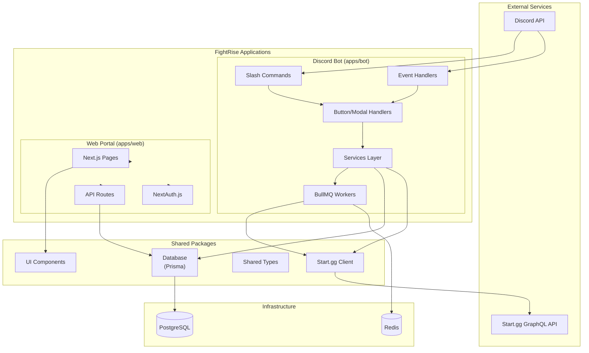
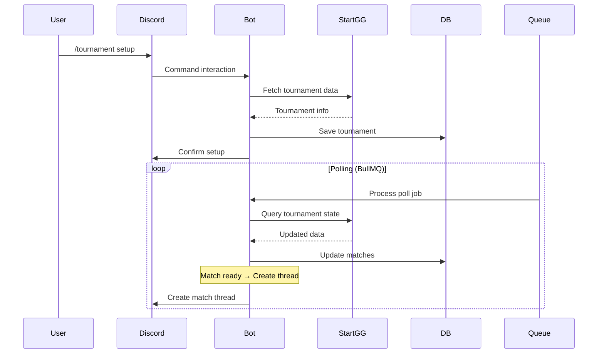
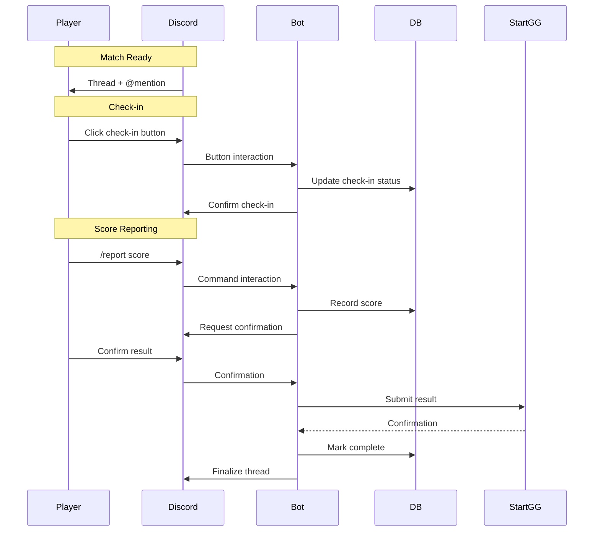

# Architecture

This document provides a high-level overview of the FightRise system architecture.

## System Overview



## Data Flow

### 1. Tournament Data Sync (Start.gg → Discord)



### 2. Match Flow (Check-in → Report → Sync)



## Directory Structure

```
fightrise-bot/
├── apps/
│   ├── bot/                    # Discord bot application
│   │   └── src/
│   │       ├── commands/        # Slash commands (9)
│   │       ├── events/          # Discord event handlers
│   │       ├── handlers/        # Button/modal interactions
│   │       ├── services/        # Business logic (6)
│   │       ├── workers/         # BullMQ workers
│   │       └── index.ts         # Bot entry point
│   │
│   └── web/                    # Next.js web portal
│       └── app/
│           ├── (auth)/          # Auth pages
│           ├── api/             # API routes
│           ├── dashboard/       # User dashboard
│           └── tournaments/     # Tournament pages
│
├── packages/
│   ├── database/               # Prisma schema & client
│   ├── startgg-client/         # GraphQL API wrapper
│   ├── shared/                 # Types & utilities
│   └── ui/                     # React components
│
└── docker/                     # Docker configurations
```

## Technology Stack

| Layer | Technology |
|-------|------------|
| **Discord Bot** | discord.js v14, BullMQ, ioredis |
| **Web Portal** | Next.js 14 (App Router), NextAuth.js |
| **Database** | PostgreSQL, Prisma ORM |
| **API Client** | GraphQL (urql), Start.gg API |
| **UI** | React, Shared component library |
| **Infrastructure** | Docker, Redis, PostgreSQL |

## Key Patterns

### Idempotent Database Operations

```typescript
const result = await prisma.match.updateMany({
  where: { id: matchId, state: MatchState.NOT_STARTED },
  data: { discordThreadId: thread.id, state: MatchState.CALLED },
});

if (result.count === 0) {
  // Already processed - skip
  return;
}
```

### Transactional Updates

```typescript
await prisma.$transaction(async (tx) => {
  await tx.match.update({ where: { id }, data: { state: 'IN_PROGRESS' } });
  await tx.matchPlayer.updateMany({
    where: { matchId: id },
    data: { isCheckedIn: true }
  });
});
```

### Service Layer Separation

- **Commands/Handlers**: Discord interaction handling
- **Services**: Business logic, database operations
- **Workers**: Async job processing (polling and sync)

## Docker Services

| Service | Port | Description |
|---------|------|-------------|
| postgres | 5432 | PostgreSQL 15 database |
| redis | 6379 | Redis 7 for BullMQ queues |
| bot | - | Discord bot (no exposed port) |
| web | 3000 | Next.js web portal |

## Related Documentation

- [Codebase Reference](Codebase-Reference) - Detailed code documentation
- [API Reference](/wiki/API-Reference) - Web API endpoints
- [Database Schema](https://github.com/wukrit/fightrise-bot/blob/main/packages/database/prisma/schema.prisma)
