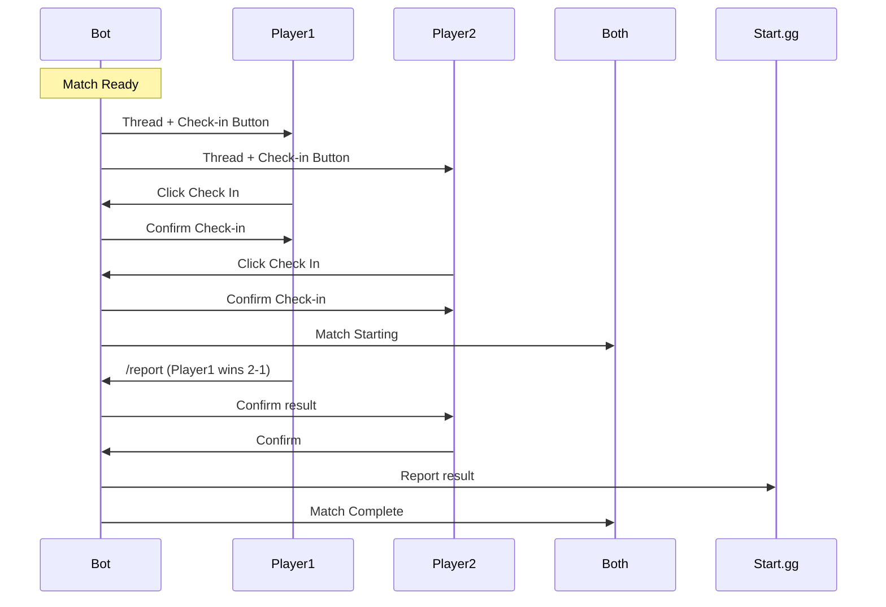

# Discord Commands Reference

FightRise provides the following Discord slash commands for tournament management.

## Available Commands

### Tournament Commands

#### /tournament setup

Configure tournament Discord settings by linking a Start.gg tournament.

**Options:**
| Option | Type | Required | Description |
|--------|------|----------|-------------|
| tournament | string | Yes | Start.gg tournament slug or URL |

**Example:**
```
/tournament setup tournament:https://start.gg/tournament/weekly-fighters
```

---

#### /tournament status

View the current status of a configured tournament.

**Options:**
| Option | Type | Required | Description |
|--------|------|----------|-------------|
| tournament | string | No | Tournament to check (defaults to current) |

---

### Registration Commands

#### /register

Register for a tournament.

**Options:**
| Option | Type | Required | Description |
|--------|------|----------|-------------|
| tournament | string | Yes | Tournament to register for |
| name | string | No | Display name (defaults to Discord username) |

---

### Match Commands

#### /checkin

Check in for your current match when called.

**Options:**
| Option | Type | Required | Description |
|--------|------|----------|-------------|
| match | string | No | Match ID (defaults to current match) |

---

#### /report

Report the score for your match.

**Options:**
| Option | Type | Required | Description |
|--------|------|----------|-------------|
| winner | user | Yes | The match winner |
| my-score | integer | Yes | Your score |
| opponent-score | integer | Yes | Opponent's score |

---

#### /my-matches

View your upcoming matches across all configured tournaments.

---

### Account Commands

#### /link-startgg

Link your Discord account to your Start.gg account for automatic registration.

**Options:**
| Option | Type | Required | Description |
|--------|------|----------|-------------|
| code | string | Yes | Authorization code from Start.gg |

---

#### /unlink-startgg

Unlink your Start.gg account from your Discord account.

---

### Admin Commands

#### /admin

Tournament administration operations.

**Subcommands:**

| Subcommand | Description |
|------------|-------------|
| `/admin add` | Add an admin to the tournament |
| `/admin remove` | Remove an admin from the tournament |
| `/admin list` | List tournament admins |
| `/admin settings` | Configure tournament settings |
| `/admin dq` | Disqualify a player |
| `/admin undo-dq` | Restore a disqualified player |

---

## Button Interactions

In addition to slash commands, FightRise uses Discord buttons for:

### Check-in Buttons

- **Check In** - Confirm your presence for the match
- **Need More Time** - Request additional check-in time

### Score Reporting Buttons

- **Report Score** - Opens modal to enter match result
- **Confirm** - Confirm the opponent's reported score
- **Dispute** - Flag a score for admin review

### Registration Buttons

- **Register** - Sign up for a tournament
- **Cancel Registration** - Withdraw from a tournament

---

## Match Flow



---

## Permissions

| Command | Required Permission |
|---------|---------------------|
| `/tournament setup` | Manage Channels |
| `/tournament status` | None |
| `/register` | None |
| `/checkin` | None |
| `/report` | None |
| `/my-matches` | None |
| `/link-startgg` | None |
| `/unlink-startgg` | None |
| `/admin` | Manage Server |

---

## Error Messages

| Error | Description |
|-------|-------------|
| `Tournament not found` | The Start.gg tournament doesn't exist or is private |
| `Not registered` | You need to register before checking in |
| `Already checked in` | You've already confirmed for this match |
| `Match not found` | No active match found for you |
| `Score mismatch` | The scores don't add up correctly |

---

## Related Documentation

- [Getting Started](/fightrise-bot/wiki/Getting-Started) - Quick start guide
- [Architecture](/fightrise-bot/wiki/Architecture) - System design
- [API Reference](/fightrise-bot/wiki/API-Reference) - Web API endpoints
